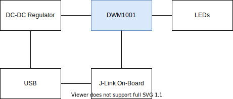

# Diagrama de bloques
  
[Contexto del sistema | Edit on diagrams.net](https://app.diagrams.net/#AFreeRTLS%2FFreeRTLS-Beacon%2FFreeRTLS-Beacon-Electronics%2Fmaster%2Fdocs%2Farchitecture%2Fblock_diagram.svg)

# Esquemático
[Aquí](../FreeRTLS-Beacon-Electronics.pdf) puedes ver o descargar el esquemático
<embed src="../FreeRTLS-Beacon-Electronics.pdf" width="600" height="500" alt="pdf" pluginspage="http://www.adobe.com/products/acrobat/readstep2.html">
